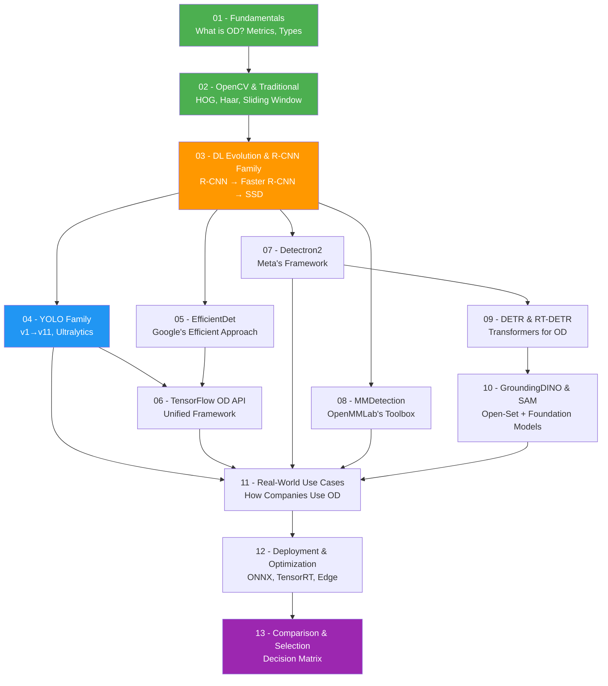

# 🎯 Object Detection Libraries - Complete Mastery Guide

> **From Zero to Hero** — The most comprehensive, beginner-friendly guide to every major Object Detection library used by top companies worldwide.

---

## 🗺️ How to Use This Guide

```
📌 If you're a complete beginner       → Start from Section 01 (Fundamentals)
📌 If you know ML/DL basics            → Jump to Section 04 (YOLO Family)
📌 If you know YOLO, want more         → Go to Section 07 (Detectron2) or 09 (DETR)
📌 If you want to compare libraries    → Go to Section 13 (Comparison Guide)
📌 If preparing for interviews         → Read 11 (Use Cases) + 13 (Comparison)
📌 If you want to deploy models        → Go to Section 12 (Deployment)
```

---

## 📚 Table of Contents

### 🟢 PART 1: FOUNDATION (Start Here — Build Strong Roots)

| # | File | Topic | Difficulty | Why This Order? |
|---|------|-------|-----------|-----------------|
| 01 | [Fundamentals of Object Detection](./01-Fundamentals-of-Object-Detection.md) | What is OD, Classification vs Detection vs Segmentation, Metrics (mAP, IoU, Precision, Recall), Bounding Boxes, History Timeline | ⭐ Beginner | You MUST understand what we're solving before touching any library |
| 02 | [OpenCV & Traditional Methods](./02-OpenCV-and-Traditional-Methods.md) | Haar Cascades, HOG + SVM, Sliding Window, DPM, Selective Search, Template Matching | ⭐ Beginner | See how OD was done BEFORE deep learning — builds intuition for why DL was needed |
| 03 | [Deep Learning OD Evolution (R-CNN Family)](./03-DL-Evolution-RCNN-Family.md) | R-CNN → Fast R-CNN → Faster R-CNN → SSD → RetinaNet, Two-stage vs One-stage, Anchor Boxes, FPN, NMS | ⭐⭐ Intermediate | This is the BRIDGE — understand this and every modern library will make sense |

---

### 🔵 PART 2: MODERN LIBRARIES (One File Per Library — Ordered by Learning Logic)

| # | File | Library | Used By | Difficulty | Why This Order? |
|---|------|---------|---------|-----------|-----------------|
| 04 | [YOLO Family (v1 to v11)](./04-YOLO-Family-Complete-Guide.md) | YOLOv1→v11, Ultralytics | Tesla, Samsung, Airbus | ⭐⭐ Intermediate | Most popular, easiest to use — your first real hands-on with modern OD |
| 05 | [EfficientDet](./05-EfficientDet.md) | Google's EfficientDet | Google, Waymo | ⭐⭐ Intermediate | Another one-stage approach — compare with YOLO, understand efficiency |
| 06 | [TensorFlow Object Detection API](./06-TensorFlow-OD-API.md) | Google's TF OD API (SSD, Faster R-CNN, EfficientDet) | Google, Waymo, Uber | ⭐⭐ Intermediate | Framework that UNIFIES many architectures — see R-CNN & SSD in practice |
| 07 | [Detectron2](./07-Detectron2.md) | Meta's Detectron2 (Mask R-CNN, etc.) | Meta, Facebook, Instagram | ⭐⭐ Intermediate | Industry-standard research framework — strong for instance segmentation |
| 08 | [MMDetection](./08-MMDetection.md) | OpenMMLab's MMDetection | Alibaba, SenseTime, Huawei | ⭐⭐ Intermediate | Most comprehensive model zoo — 300+ models, great for research |
| 09 | [DETR & RT-DETR](./09-DETR-and-RT-DETR.md) | Transformer-based Detection | Meta, Baidu | ⭐⭐⭐ Advanced | New paradigm: Transformers replace CNN — understand the future |
| 10 | [GroundingDINO & SAM](./10-GroundingDINO-and-SAM.md) | Open-Set Detection + Segment Anything | Meta, IDEA Research | ⭐⭐⭐ Advanced | Cutting-edge: detect ANY object with text prompts — the frontier |

---

### 🟣 PART 3: REAL WORLD & PRODUCTION (Apply What You Learned)

| # | File | Topic | Difficulty | Why This Order? |
|---|------|-------|-----------|-----------------|
| 11 | [Real-World Use Cases by Companies](./11-Real-World-UseCases.md) | How Tesla, Google, Amazon, Meta use OD in Production | ⭐⭐ Intermediate | Now you know the tools — see how giants combine them |
| 12 | [Deployment & Optimization](./12-Deployment-and-Optimization.md) | ONNX, TensorRT, OpenVINO, Edge, Mobile, Quantization, Pruning | ⭐⭐⭐ Advanced | Making models FAST for real production — the final skill |
| 13 | [Comparison & Selection Guide](./13-Comparison-and-Selection-Guide.md) | When to Use What, Speed vs Accuracy, Decision Matrix, Interview Prep | ⭐⭐ Intermediate | Final summary — pick the right tool for any situation |

---

### 🟡 PART 4: ADDITIONAL LIBRARIES

| # | File | Library | Used By | Difficulty | Why This Order? |
|---|------|---------|---------|-----------|-----------------|
| 14 | [MediaPipe Complete Guide](./14-MediaPipe-Complete-Guide.md) | Google MediaPipe (Face, Hands, Pose, Object Detection) | Google, Snapchat, Peloton, TikTok | ⭐⭐ Intermediate | The #1 framework for real-time on-device ML — mobile, web, and edge |

---

## 🏗️ Learning Roadmap (Recommended Path)



### 📖 Why This Sequence Works (Pedagogical Logic)

```
PHASE 1: BUILD INTUITION
━━━━━━━━━━━━━━━━━━━━━━━
01 Fundamentals     → "What problem are we solving?"
02 Traditional      → "How was it solved before DL?" (appreciate DL's value)
03 R-CNN Family     → "How did DL enter OD?" (two-stage → one-stage evolution)

PHASE 2: MASTER MODERN TOOLS
━━━━━━━━━━━━━━━━━━━━━━━━━━━━
04 YOLO             → "The fastest, most popular" (one-stage, learn by doing)
05 EfficientDet     → "Google's efficient alternative" (compare with YOLO)
06 TF OD API        → "A framework hosting many models" (see SSD, Faster R-CNN in code)
07 Detectron2       → "Meta's research powerhouse" (instance segmentation, Mask R-CNN)
08 MMDetection      → "The biggest model zoo" (300+ models, config-driven)

PHASE 3: UNDERSTAND THE FUTURE
━━━━━━━━━━━━━━━━━━━━━━━━━━━━━━
09 DETR/RT-DETR     → "Transformers replace anchors" (new paradigm)
10 GroundingDINO/SAM → "Detect anything with text" (foundation models)

PHASE 4: BECOME PRODUCTION-READY
━━━━━━━━━━━━━━━━━━━━━━━━━━━━━━━━
11 Real-World Cases  → "See how it all fits together"
12 Deployment        → "Make it fast & production-grade"
13 Comparison Guide  → "Choose the right tool, always"
```

---

## 🏢 Which Companies Use What?

| Company | Primary Library | Use Case |
|---------|----------------|----------|
| **Tesla** | YOLO + Custom | Autopilot, FSD |
| **Google/Waymo** | EfficientDet, TF OD API | Self-driving, Google Lens |
| **Meta/Facebook** | Detectron2, DETR, SAM | Content moderation, AR filters |
| **Amazon** | Custom + YOLO | Amazon Go, warehouse robots |
| **Microsoft** | Custom + YOLO | Azure Cognitive Services |
| **Alibaba** | MMDetection | Product search, logistics |
| **Uber** | TF OD API + Custom | Autonomous vehicles |
| **Samsung** | YOLO (mobile) | Camera AI, Bixby Vision |
| **Airbus** | YOLOv8 | Satellite imagery analysis |
| **Walmart** | YOLO + Custom | Shelf monitoring, checkout |
| **NVIDIA** | All (inference focus) | TensorRT optimization |
| **Baidu** | RT-DETR, PaddleDetection | Apollo self-driving |
| **Apple** | Custom (Core ML) | Face ID, Photos app |
| **ByteDance/TikTok** | MMDetection, YOLO | Content filters, effects |

---

## 📊 Quick Comparison Matrix

| Library | Speed | Accuracy | Ease of Use | Production Ready | Mobile |
|---------|-------|----------|-------------|-----------------|--------|
| YOLOv8/v11 | ⚡⚡⚡⚡⚡ | ⭐⭐⭐⭐ | ⭐⭐⭐⭐⭐ | ✅ | ✅ |
| Detectron2 | ⚡⚡⚡ | ⭐⭐⭐⭐⭐ | ⭐⭐⭐ | ✅ | ❌ |
| MMDetection | ⚡⚡⚡ | ⭐⭐⭐⭐⭐ | ⭐⭐⭐ | ✅ | ❌ |
| EfficientDet | ⚡⚡⚡⚡ | ⭐⭐⭐⭐ | ⭐⭐⭐ | ✅ | ✅ |
| DETR | ⚡⚡ | ⭐⭐⭐⭐ | ⭐⭐⭐ | ✅ | ❌ |
| RT-DETR | ⚡⚡⚡⚡ | ⭐⭐⭐⭐⭐ | ⭐⭐⭐⭐ | ✅ | ✅ |
| GroundingDINO | ⚡⚡ | ⭐⭐⭐⭐ | ⭐⭐⭐⭐ | ⚠️ | ❌ |
| SAM 2 | ⚡⚡⚡ | ⭐⭐⭐⭐⭐ | ⭐⭐⭐⭐ | ✅ | ✅ |
| TF OD API | ⚡⚡⚡ | ⭐⭐⭐⭐ | ⭐⭐ | ✅ | ✅ |
| OpenCV DNN | ⚡⚡⚡⚡ | ⭐⭐⭐ | ⭐⭐⭐⭐ | ✅ | ✅ |

---

## 🎯 What You'll Master After This Guide

After completing all sections, you will be able to:

- ✅ Understand how object detection works from scratch
- ✅ Choose the right library for ANY use case
- ✅ Train custom models on your own dataset
- ✅ Deploy models to production (cloud, edge, mobile)
- ✅ Optimize models for real-time performance
- ✅ Explain architectures in interviews confidently
- ✅ Build production-grade detection systems like top companies

---

## 🛠️ Prerequisites

| Requirement | Level Needed | Resource |
|-------------|-------------|----------|
| Python | Basic (variables, loops, functions) | Any Python tutorial |
| NumPy/Pandas | Basic (array operations) | NumPy documentation |
| Deep Learning | Basic concepts (what is CNN, layers) | Andrew Ng's course |
| PyTorch or TensorFlow | Able to run basic code | Official tutorials |
| Linux/Terminal | Basic commands | - |

---

## 📦 Environment Setup (Do This First!)

```bash
# Create a virtual environment
python -m venv od_env
source od_env/bin/activate  # Linux/Mac
# od_env\Scripts\activate   # Windows

# Core packages (install as needed per library)
pip install torch torchvision          # PyTorch (base for most libraries)
pip install ultralytics                # YOLO v8/v11
pip install opencv-python              # OpenCV
pip install numpy matplotlib           # Utilities
```

---

## 📝 Notes Convention Used in This Guide

| Symbol | Meaning |
|--------|---------|
| 💡 | Key insight / Important concept |
| ⚠️ | Common mistake / Warning |
| 🏢 | Real company use case |
| 🔥 | Interview important |
| 📝 | Code example follows |
| 🧠 | Deep dive / Advanced |
| ✅ | Best practice |
| ❌ | Anti-pattern / Don't do this |

---

## 🔄 Version History

| Date | Update |
|------|--------|
| 2026-06-18 | Initial creation - Complete guide structure |

---

> 💡 **Pro Tip**: Star/Bookmark this INDEX file. Always come back here to navigate between topics.

---

*Created with ❤️ for aspiring AI Engineers and Computer Vision developers.*
